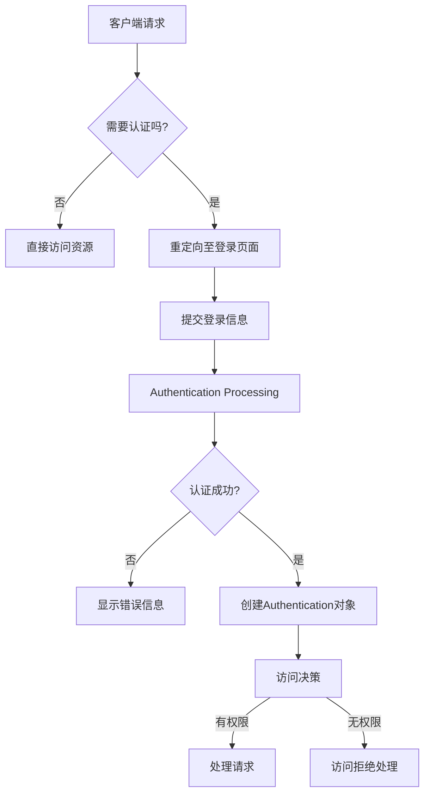

---

order: 80
title:  Spring Security

---


## SpringSecurity快速入门

Spring Security是一款基于Spring的安全框架，主要包含认证和授权两大安全模块。下面将以SpringBoot来集成Spring Security为例


### 引入Spring Security

在Spring Boot项目，引入spring-boot-starter-security

```xml
        <dependency>
            <groupId>org.springframework.boot</groupId>
            <artifactId>spring-boot-starter-security</artifactId>
        </dependency>
```


接下来我们创建一个HelloController，对外提供一个`/hello`服务：
```java
@RestController
public class HelloController {
    // 创建一个方法，用于处理请求
    @GetMapping("hello")
    public String hello() {
        // 返回一个简单的欢迎信息
        return "hello spring security";
    }
}
```
直接启动项目，访问`http://localhost:8080/hello`，页面会弹出一个HTTP Basic认证框

::: warning SpringBoot1.x中开启Spring Security的配置
在Spring Boot 1.x版本中，可以通过在application.properties或application.yml中设置`security.basic.enabled`属性来启动或禁用Spring Security的基本认证. 
当Spring项目中引入了Spring Security依赖的时候，项目会默认开启如下配置：
```properties
security:
  basic:
    enabled: true
```
==注意== ：Spring Boot 2.0引入了Spring Security 5，并随之移除了`security.basic.enabled`这个配置属性。在Spring Security 5中，默认情况下，如果你引入了Spring Security的依赖项，基础的安全特性会自动启用。
::: 


### Spring Security基本原理

Spring Security的核心设计基于一系列过滤器（Filter）组成的过滤器链（Filter Chain），这些过滤器共同协作处理HTTP请求，确保每个请求在访问受保护资源前都经过适当的安全检查。

1. **初始化阶段**：
   - Spring Security 在应用启动时初始化，通过Spring的IoC容器管理其组件。核心是`SecurityFilterChain`，它由多个过滤器组成，这些过滤器负责不同的安全任务，如认证（Authentication）、授权（Authorization）、会话管理、异常处理等。
   - `FilterChainProxy` 是所有过滤器的入口点，它根据请求URL匹配对应的过滤器链，并依次调用链中的过滤器。

2. **过滤器链**：
   - 过滤器链包括但不限于：
     - `SecurityContextPersistenceFilter`：维护安全上下文（Security Context）跨请求的持续性。
     - `UsernamePasswordAuthenticationFilter`：处理表单登录请求。
     - `DefaultLoginPageGeneratingFilter` 和 `DefaultLogoutPageGeneratingFilter`：分别生成默认登录和注销页面。
     - `ExceptionTranslationFilter`：捕获并处理认证和授权异常。
     - `FilterSecurityInterceptor`：执行访问决策，决定用户是否有权访问请求的资源。

3. **认证流程**：
   - 用户发起请求，请求到达`FilterChainProxy`。
   - 如果用户未认证，根据配置可能被重定向至登录页面。
   - 用户提交认证信息，如用户名和密码。
   - `UsernamePasswordAuthenticationFilter`处理这些信息，尝试认证用户。
   - 成功认证后，会创建一个`Authentication`对象，并将其存储在安全上下文中。
   
4. **授权流程**：
   - 经过认证的请求继续通过过滤器链，到达`FilterSecurityInterceptor`。
   - 此过滤器使用访问决策管理器（Access Decision Manager）来决定用户是否有权限访问请求的资源。
   - 如果用户有权限，请求继续处理；否则，将抛出访问被拒的异常。




此图简化展示了Spring Security处理请求的基本流程，从客户端请求开始，经过认证、授权，直到最终处理请求或拒绝访问的过程。实际应用中，流程可能更加复杂，涉及更多的过滤器和安全配置细节。


### Spring Security配置示例

#### 配置的入口点

- **WebSecurityConfigurerAdapter**：在Spring Security 5以前，一般通过扩展`WebSecurityConfigurerAdapter`类来自定义安全配置。但是从Spring Security 5.4.0开始，推荐使用更灵活的Lambda配置风格。

- **SecurityFilterChain**：从Spring Security 5.4.0开始，建议使用`SecurityFilterChain`的Bean来进行配置。这种方式更加灵活，更易于组合和重用。

::: tip Spring Security 6.1新特性
在SpringSecurity6版本中`@EnableGlobalMethodSecurity`被弃用，使用了新的注解 `@EnableMethodSecurity`。
:::

#### 核心配置元素

- **身份验证**：通过`.authenticationManager()`配置全局的身份验证策略。可以使用内存中的用户、JDBC或LDAP来存储用户信息。

- **授权**：使用`.authorizeRequests()`来定义哪些URL需要被保护，以及它们的访问权限。可以为特定路径指定角色或权限。

- **表单登录**：`.formLogin()`提供了基于表单的登录支持，包括定制登录页面和默认的登录/登出处理。

- **HTTP基本认证**：`.httpBasic()`用于简单的API的无状态认证（建议仅在测试和学习环境使用）

- **跨站请求伪造（CSRF）保护**：默认启用，可以通过`.csrf().disable()`来禁用，但不推荐。


::: code-tabs#Spring Security config

@tab:active SpringSecurity6+配置

```java
@Configuration
@EnableWebSecurity
@EnableMethodSecurity
public class SecurityConfig {

    @Autowired
    private JwtAuthenticationFilter jwtAuthenticationFilter;
    @Autowired
    private SysUserDetailsService sysUserDetailsService;
    @Autowired
    private SysAuthorizationManager authorizationManager;

    /**
     * 配置过滤器链，对login接口放行
     */
    @Bean
    public SecurityFilterChain filterChain(HttpSecurity http) throws Exception {
        http.csrf(csrf -> csrf.disable());
        // 放行login接口
        http.authorizeHttpRequests(auth -> auth.requestMatchers("/auth/**").permitAll()
                .anyRequest().access(authorizationManager)
        );
        // 将过滤器添加到过滤器链中
        http.formLogin(Customizer.withDefaults());
        http.rememberMe(Customizer.withDefaults());
        // 将过滤器添加到 UsernamePasswordAuthenticationFilter 之前
        http.addFilterBefore(jwtAuthenticationFilter, UsernamePasswordAuthenticationFilter.class);
        return http.build();
    }

    /**
     * AuthenticationManager：负责认证的
     * DaoAuthenticationProvider：负责将 sysUserDetailsService、passwordEncoder融合起来送到AuthenticationManager中
     * @param passwordEncoder
     * @return
     */
    @Bean
    public AuthenticationManager authenticationManager(PasswordEncoder passwordEncoder) {
        DaoAuthenticationProvider provider = new DaoAuthenticationProvider();
        provider.setUserDetailsService(sysUserDetailsService);
        provider.setPasswordEncoder(passwordEncoder);
        // 将provider放置进 AuthenticationManager 中
        ProviderManager providerManager = new ProviderManager(provider);

        return providerManager;
    }

    @Bean
    public PasswordEncoder passwordEncoder() {
        return new BCryptPasswordEncoder();
    }

}
```

@tab 老版本配置

```java
@Configuration
@EnableWebSecurity
public class WebSecurityConfig extends WebSecurityConfigurerAdapter {

  @Override
  protected void configure(HttpSecurity http) throws Exception {
      http
          .authorizeRequests()
              .antMatchers("/", "/home").permitAll()
              .anyRequest().authenticated()
              .and()
          .formLogin()
              .loginPage("/login")
              .permitAll()
              .and()
          .logout()
              .permitAll();
  }

  @Autowired
  public void configureGlobal(AuthenticationManagerBuilder auth) throws Exception {
      auth
          .inMemoryAuthentication()
              .withUser("admin").password("admin").roles("USER");
  }
}
```

:::


## Spring Security核心组件

### SecurityFilterChain

在Spring Security中，`SecurityFilterChain`是一个核心的概念，它是过滤器链的集合，用于处理传入的HTTP请求的安全性。`SecurityFilterChain`负责将多个安全过滤器串联起来形成一个处理流程，每个过滤器执行其特定的安全功能，如身份验证、授权、CSRF保护等。

当一个HTTP请求到达应用时，它会首先被Spring的`DispatcherServlet`捕获，然后根据配置的`SecurityFilterChain`，通过一系列的安全过滤器进行处理。这些过滤器以链式的方式组织，允许开发者在适当的点插入自定义的安全逻辑。

在Spring Security 5.4.0之前，安全配置通常是通过继承`WebSecurityConfigurerAdapter`类并重写其中的方法来完成的。这种方式虽然简单，但在一些场景下可能会遇到局限性，特别是在需要定义多个安全配置时。

相比之下，使用`SecurityFilterChain` Bean的配置方式提供了更高的灵活性和更容易的重用性。它允许直接操作`HttpSecurity`对象来构建安全过滤器链，使得配置更加直观和声明式。


### AuthenticationManager

AuthenticationManager是Spring Security中的一个核心接口，它主要负责处理身份认证。接口定义相当简单，只包含一个认证方法：

```java
public interface AuthenticationManager {
    Authentication authenticate(Authentication authentication) throws AuthenticationException;
}
```

在Spring Security中，`AuthenticationManager`接受一个`Authentication`对象作为未认证的请求，然后尝试对其进行认证。如果认证成功，它将返回一个已认证的`Authentication`实例，包含用户的权限等信息；如果认证失败，则抛出`AuthenticationException`。

`AuthenticationManager`可以有多个实现，但最常用的是`ProviderManager`，它维护一个列表的`AuthenticationProvider`实例。每一个`AuthenticationProvider`也是一个身份认证的策略。当一个认证请求到来时：

- `ProviderManager`将请求传递给每一个`AuthenticationProvider`。
- 每一个`AuthenticationProvider`尝试认证，并返回一个已认证的`Authentication`对象。
- 如果所有的`AuthenticationProvider`都不能认证请求，那么将抛出一个`AuthenticationException`。


### UserDetailsService

`UserDetailsService`是Spring Security中的一个核心接口，它用于按用户名检索用户的详细信息。具体来说，它只定义了一个方法：

```java
UserDetails loadUserByUsername(String username) throws UsernameNotFoundException;
```

当用户尝试登录时，认证过程需要获取用户的详细信息进行比对，`UserDetailsService`的任务就是提供这些详细信息。


`UserDetailsService`的`loadUserByUsername`方法接收一个用户名作为参数，返回一个`UserDetails`对象。`UserDetails`是另一个核心接口，它封装了用户的信息，如用户名、密码、权限等。

在实际应用中，开发者需要实现`UserDetailsService`接口，以提供访问应用特定存储（如数据库、LDAP等）的逻辑，从而获取`UserDetails`。Spring Security的认证管理器（`AuthenticationManager`）使用这个服务来获得用户信息并执行认证。

#### UserDetailsService的使用

实现`UserDetailsService`通常涉及创建一个新的类，实现`UserDetailsService`接口，并提供`loadUserByUsername`方法的具体实现。以下是一个简单的例子：

```java
@Service
public class MyUserDetailsService implements UserDetailsService {

    @Autowired
    private UserRepository userRepository;

    @Override
    public UserDetails loadUserByUsername(String username) throws UsernameNotFoundException {
        User user = userRepository.findByUsername(username)
            .orElseThrow(() -> new UsernameNotFoundException("User not found with username: " + username));
        
        return new org.springframework.security.core.userdetails.User(user.getUsername(), user.getPassword(), new ArrayList<>());
    }
}
```

#### UserDetailsService注意事项

(1). **异常处理**：如果`loadUserByUsername`未能找到用户，它应该抛出一个`UsernameNotFoundException`。

(2). **密码加密**：在验证用户时，Spring Security会比较提交的密码和`UserDetails`中存储的密码。为了安全，存储的密码应该是加密过的，开发者需要配置一个密码编码器（如`BCryptPasswordEncoder`）。

(3). **权限和角色**：`UserDetails`应该包含用户的权限（通常以角色的形式）。这对应用的安全访问控制至关重要。在返回的`UserDetails`中，可以设置用户的角色或权限。

(4). **定制`UserDetails`**：可以通过实现自定义的`UserDetails`类来扩展用户信息。这对于存储应用特定的用户信息很有用。


### UserDetails

`UserDetails` 是 Spring Security 中的一个核心接口，用于封装认证主体的详细信息。任何需要身份验证的实体都可以实现此接口来提供必要的信息。

UserDetails 提供了以下关键信息：

（1）**用户名**：通过 `getUsername` 方法获取，通常是用户登录时用的标识信息。
（2）**密码**：通过 `getPassword` 方法获取，通常是用于认证过程中比对的加密后的密码。
（3）**权限**：通过 `getAuthorities` 方法获取，返回一个 `GrantedAuthority` 对象的集合，表示用户所拥有的权限和角色。
（4）**账户状态**：通过以下几个布尔值方法获取，用于表明用户的账户状态。
   - `isAccountNonExpired()`：账户是否未过期。
   - `isAccountNonLocked()`：账户是否未被锁定。
   - `isCredentialsNonExpired()`：凭证（密码）是否未过期。
   - `isEnabled()`：账户是否启用。

#### 实现 UserDetails 接口

Spring Security 提供了一个具体的 `UserDetails` 实现，即 `org.springframework.security.core.userdetails.User` 类。在大多数情况下，可以直接使用或扩展此类而不必从头开始实现 `UserDetails` 接口。

为了满足特定需求，您可以创建一个实现 `UserDetails` 的自定义类：

```java
public class CustomUserDetails implements UserDetails {
    // 用户实体中的其他字段。

    @Override
    public String getPassword() {
        // 返回用户密码。
    }

    @Override
    public String getUsername() {
        // 返回用户名或邮箱等标识。
    }

    // 实现其他的方法...

    // 加入自定义字段及方法，例如用户ID、姓名等。
}
```


### GrantedAuthority

`GrantedAuthority`是Spring Security框架中的一个核心接口，用于表示用户所拥有的权限或者角色。在认证过程中，一旦用户成功验证了他们的凭证（如用户名和密码），系统就会创建一个`Authentication`对象，该对象中包含了关于已认证用户的详细信息，其中包括一组`GrantedAuthority`对象。这一组`GrantedAuthority`代表了用户被授予的所有权限，用于后续的授权决策。

#### 核心特点：

- **权限表示**：每个`GrantedAuthority`实例都代表一个权限或角色，例如"ROLE_USER"、"ROLE_ADMIN"等。在Spring Security中，角色通常以"ROLE_"为前缀，以便区分普通权限。

- **集合形式**：`Authentication`接口的`getAuthorities()`方法返回的是`Collection<GrantedAuthority>`类型，表明一个用户可以拥有多个权限或角色。

- **简单实现**：最常见的`GrantedAuthority`实现类是`SimpleGrantedAuthority`，它仅包含一个权限字符串，没有额外的逻辑或状态。

- **授权决策**：在进行访问控制时，Spring Security会检查用户拥有的`GrantedAuthority`是否满足资源访问所需的权限。例如，使用`@PreAuthorize("hasRole('ROLE_ADMIN')")`注解的方法会检查用户是否具有"ROLE_ADMIN"权限。


### **PasswordEncoder**

`PasswordEncoder` 是 Spring Security 提供的用于密码加密的接口，它是 Spring Security 认证过程中非常关键的部分。在存储或验证用户密码时，使用 `PasswordEncoder` 可以确保以安全的方式处理密码。


`PasswordEncoder` 接口定义了主要的两个方法：

- **encode(CharSequence rawPassword)**：接收一个原始密码并返回加密后的密码字符串。这个方法在用户注册或更改密码时被用来加密新密码。

- **matches(CharSequence rawPassword, String encodedPassword)**：比较原始密码与加密后的密码是否匹配。在用户登录时，用来验证用户输入的密码与数据库中存储的加密密码是否符合。

#### 常用实现

Spring Security 提供了多种 `PasswordEncoder` 的实现，其中 `BCryptPasswordEncoder` 是其中一种广泛使用的实现，它使用 BCrypt 强哈希函数来加密密码。

其他实现如 `NoOpPasswordEncoder`（不进行加密，不推荐使用）、`Pbkdf2PasswordEncoder`、`SCryptPasswordEncoder` 等，根据需求选择合适的加密方式。

#### 使用示例

#### 配置 PasswordEncoder Bean

首先，需要在 Spring Security 配置中定义一个 `PasswordEncoder` 的 Bean，通常选择使用 `BCryptPasswordEncoder`：

```java
import org.springframework.context.annotation.Bean;
import org.springframework.security.crypto.bcrypt.BCryptPasswordEncoder;
import org.springframework.security.crypto.password.PasswordEncoder;

@Configuration
public class SecurityConfig {

    @Bean
    public PasswordEncoder passwordEncoder() {
        return new BCryptPasswordEncoder();
    }
}
```

#### 加密密码

当用户注册或更改密码时，使用 `PasswordEncoder` 加密密码：

```java
@Autowired
private PasswordEncoder passwordEncoder;

public void registerUser(String username, String rawPassword) {
    String encodedPassword = passwordEncoder.encode(rawPassword);
    // 将加密后的密码存储到数据库中
}
```

#### 验证密码

用户登录时，比较输入的密码与数据库中加密的密码是否匹配：

```java
public boolean login(String username, String rawPassword) {
    // 从数据库获取用户信息，包括加密的密码
    User user = userService.findByUsername(username);

    if (user != null && passwordEncoder.matches(rawPassword, user.getPassword())) {
        // 密码匹配，登录成功
        return true;
    }

    // 登录失败
    return false;
}
```

#### 注意事项

1. 当使用 `BCryptPasswordEncoder` 时，每次加密的结果都会不同，这是因为它在内部生成了一个随机盐（Salt）。但即便如此，`matches` 方法仍能正确验证原始密码与加密密码是否匹配。

2. 强烈建议不要使用 `NoOpPasswordEncoder`，因为它不会对密码进行加密，这会大大降低应用的安全性。

3. 实现自定义的 `PasswordEncoder` 时，务必确保它的加密算法足够强大，能够抵御对密码的猜测与破解攻击。

通过这些方式，`PasswordEncoder` 提供了一种灵活且安全的机制来处理用户密码的存储与验证，是构建安全应用的重要基石。


::: info BCryptPasswordEncoder工作原理

`BCryptPasswordEncoder` 使用的是散列技术，它将密码转换成一个固定长度的串（称为散列或哈希），这个过程是不可逆的

### 盐（Salt）的角色

盐（Salt）是一个随机生成的数据片段，它在密码加密过程中与原始密码一起混合，目的是增加密码加密形式的随机性，从而保护密码不被通过彩虹表等方式破解。

### BCryptPasswordEncoder 工作流程

1. **加密时**：当 `encode` 方法被调用时，`BCryptPasswordEncoder` 内部会生成一个新的随机盐。然后，它将盐和原始密码结合，并执行加密算法。算法的结果是一个包含盐的加密密码。这就意味着，即使多次使用同一个原始密码，由于盐的随机性，每次生成的加密密码都是唯一的。

2. **匹配时**：`matches` 方法接收一个原始密码和一个已加密的密码。加密密码字符串的结构设计成包含了用于该特定密码加密的盐。因此，当进行匹配时，`BCryptPasswordEncoder` 提取出存储在加密密码中的盐，并使用它来对提供的原始密码进行加密。如果原始密码正确，即使它是用不同的盐加密的，这种再次加密的结果应该与存储的加密密码相同。

### 实现细节

BCrypt 加密算法的输出格式通常遵循以下结构：

```
$2a$strength$salt$encryptedpassword
```

- `$2a$` 是算法的版本。
- `strength` 是一个表示算法计算复杂度的数字（比如 10, 12 等），这个数字越高，计算所需的时间越长。
- `salt` 是算法使用的盐。
- `encryptedpassword` 是盐和密码经过算法计算得到的哈希值。

由于加密字符串内含有生成它的盐，所以 `matches` 方法可以在不知道原始盐的情况下验证密码。

这种设计巧妙地解决了需要保留盐值以供以后密码验证的问题。盐值无需单独存储，因为它已经是加密密码字符串的一部分，这也就简化了系统的设计和实现。
:::


## Spring Security权限管理

### @EnableMethodSecurity
- **作用**：此注解用于开启Spring Security的方法安全支持，允许你在方法级别上控制访问权限。它替代了早期版本中的@EnableGlobalMethodSecurity。
- **特性**：支持注解驱动的权限检查，如`@PreAuthorize`, `@PostAuthorize`, `@PreFilter`, `@PostFilter`等，并且默认启用了SpEL表达式。
- **使用示例**：
```java
@EnableMethodSecurity
public class SecurityConfig {
    // 配置类的其他部分
}
```


### @PreAuthorize, @PostAuthorize
- **@PreAuthorize**：在方法执行前进行权限检查。如果权限检查失败，则方法不会被执行。
- **@PostAuthorize**：在方法执行后进行权限检查。这可以用来根据方法的返回值决定是否允许访问。
- **使用示例**：
```java
@PreAuthorize("hasRole('ADMIN')")
public void adminOnlyMethod() {
    // 仅管理员可访问
}

@PostAuthorize("returnObject.username == authentication.name")
public User getUserDetails(String username) {
    // 返回用户详情，但只有当请求的用户与登录用户相同时才允许
}
```

### hasAuthority, hasRole
- **hasAuthority**: 用于检查用户是否拥有指定的权限（权限通常指细粒度的权限标识，如"read:article"）。
- **hasRole**: 用于检查用户是否拥有指定的角色（角色是权限的集合，如"ROLE_ADMIN"）。注意，使用`hasRole`时，实际上需要指定以"ROLE_"为前缀的角色名，除非你自定义了角色前缀。
- **示例**：
```java
@PreAuthorize("hasAuthority('read:article')")
public List<Article> readArticles() {
    // 具有读文章权限的用户可访问
}

@PreAuthorize("hasRole('ADMIN')")
public void adminTask() {
    // 管理员角色可访问
}
```

### Spring Security SpEL 

Spring Security SpEL 是基于标准的Spring Expression Language (SpEL) 的一个特化应用，主要服务于Spring Security框架中的安全需求。

- **简介**：Spring Expression Language (SpEL) 是Spring框架提供的强大表达式语言，用于在运行时查询和操作对象图。在Spring Security中，SpEL被广泛用于进行复杂的权限判断。
- **基本语法**：SpEL 支持各种操作符，如逻辑运算符(`and`, `or`, `!`)、关系运算符(`==`, `<`, `>`等)、函数调用等。
- **示例**：
```java
@PreAuthorize("@myBean.method(authentication) and hasRole('USER')")
public void someMethod() {
    // 示例中调用了自定义bean的方法并结合角色检查
}
```

::: tip 实际项目中的使用建议与注意事项
1. **最小权限原则**：为每个角色或用户分配刚好足够的权限来完成其工作，避免过度授权。
2. **使用具体权限而非泛用角色**：尽量使用`hasAuthority`指定具体权限，这样可以实现更细粒度的权限控制。
3. **安全性与性能考量**：虽然方法级别的安全控制提供了灵活性，但也可能影响性能，特别是在复杂表达式或大量数据过滤的情况下。
4. **测试**：确保充分测试所有安全相关的逻辑，包括边缘情况和异常处理，以防止安全漏洞。
5. **文档化权限设计**：清晰记录每个角色和权限的定义，便于维护和审计。
6. **自定义需求**：Spring Security高度可配置，如果标准注解不满足需求，可以通过自定义访问决策管理器等扩展点来实现更复杂的安全策略。
:::