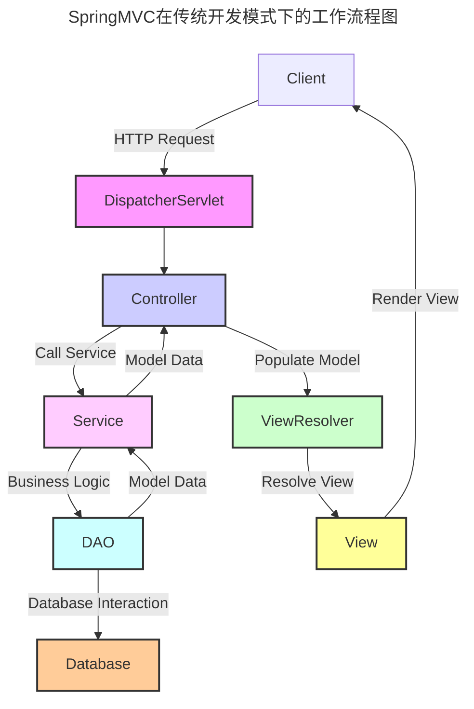
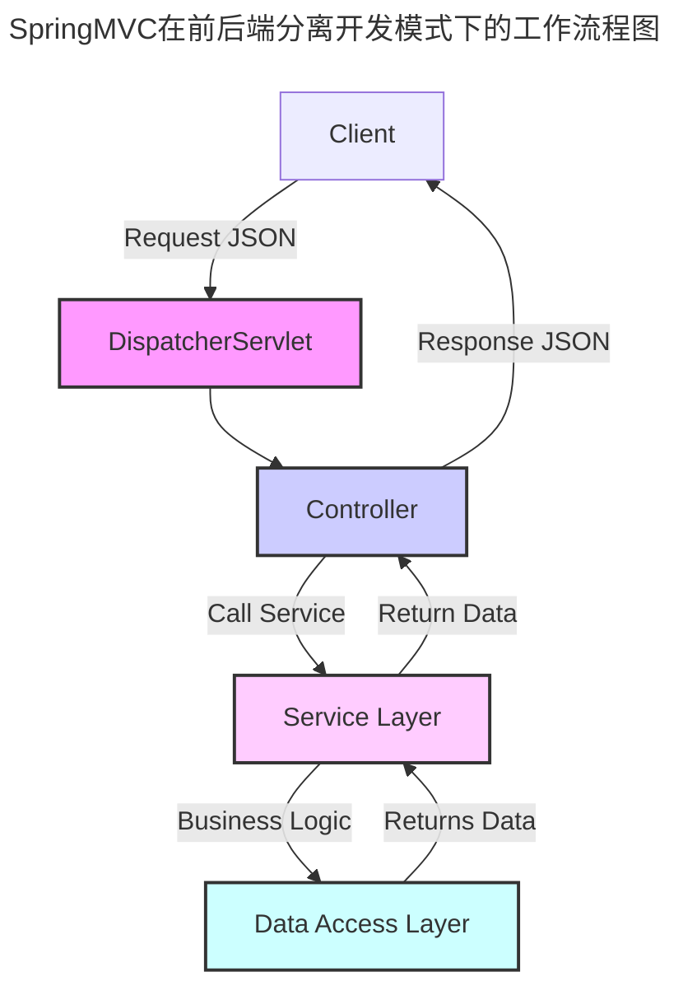
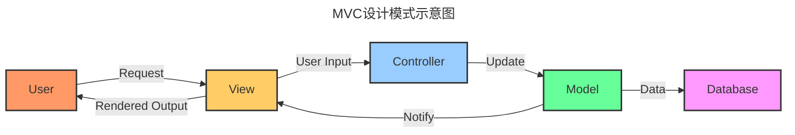

---

order: 40
title:  SpringMVC快速上手

---

## 创建Spring MVC项目

创建Spring MVC项目有多种方式，这里将详细介绍两种流行方法：手动创建和使用Spring Initializr。

### 方法一：手动创建

1. **安装和配置JDK**   
   - 下载并安装JDK。
   - 设置环境变量`JAVA_HOME`并更新`PATH`。

2. **安装Maven或Gradle**   
   - 下载并安装Maven或Gradle。
   - 设置环境变量`M2_HOME`（Maven）或`GRADLE_HOME`（Gradle）并更新`PATH`。

3. **设置项目构建文件**   
   - 创建一个新的目录作为项目根文件夹。
   - 在该目录中创建构建配置文件：`pom.xml`（Maven）或`build.gradle`（Gradle）。
   - 添加必要的Spring MVC依赖项及其他相关配置。

4. **创建项目目录结构**   
   - 创建以下目录结构：
     ```
     src
     ├── main
     │   ├── java
     │   ├── resources
     │   └── webapp
     │       └── WEB-INF
     └── test
         ├── java
         └── resources
     ```
   - 项目代码将放在`src/main/java`，资源文件放在`src/main/resources`，而Web页面和JSP文件则放在`src/main/webapp`。

5. **配置Web.xml**   
   - 在`src/main/webapp/WEB-INF`目录中创建`web.xml`文件。
   - 配置Spring的`DispatcherServlet`，它是Spring MVC的核心。

6. **创建Spring配置文件**   
   - 在`src/main/resources`中创建Spring配置文件，如`applicationContext.xml`。

7. **编写控制器，视图和模型**   
   - 创建Java类文件用作模型（Model），控制器（Controller），和服务层（Service）。
   - 创建JSP/HTML文件作为视图（View）。

8. **构建和运行**   
   - 在命令行中，使用Maven或Gradle命令构建项目（例如：`mvn clean install`或`gradle build`）。
   - 运行内置服务器或部署到外部Web服务器如Tomcat。

### 方法二：使用Spring Initializr

1. **访问Spring Initializr**   
   - 访问`https://start.spring.io/`。

2. **选择项目配置**   
   - 选择构建工具（Maven/Gradle）、Spring Boot版本、语言（Java/Kotlin/Groovy）、项目元信息（例如组名和项目名称）。

3. **添加依赖项**   
   - 添加`Spring Web`和其他所需依赖。

4. **生成项目**   
   - 点击生成，下载生成的zip文件。

5. **解压并打开项目**   
   - 解压下载的zip文件，并使用IDE（如IntelliJ IDEA或Eclipse）打开。

6. **编写代码**   
   - 创建新的控制器，服务和存储库类，编写业务逻辑。

7. **运行应用程序**   
   - 在IDE中运行主应用程序类，或在命令行使用相应的构建工具命令（如`mvn spring-boot:run`或`gradle bootRun`）来启动项目。

使用Spring Initializr的好处是，它自动处理了许多配置问题，并提供了一个即用型的项目结构，极大地简化了初始化过程。基本上，你需要的只是选择合适的依赖项和配置，其余工作Initializr都会帮你完成。


## 配置开发SpringMVC项目

### 配置Web.xml

在Spring MVC项目中，`web.xml`文件位于应用的`WEB-INF`目录下，它是Java EE Web应用的部署描述文件。尽管Spring Boot项目通常不需要`web.xml`文件（因为它采用了自动配置的方式），但在传统的Spring MVC项目中，你可能需要手动配置它。

以下是配置`web.xml`文件来设置`DispatcherServlet`的步骤：

```xml
<web-app version="3.1" xmlns="http://xmlns.jcp.org/xml/ns/javaee"
         xmlns:xsi="http://www.w3.org/2001/XMLSchema-instance"
         xsi:schemaLocation="http://xmlns.jcp.org/xml/ns/javaee
                             http://xmlns.jcp.org/xml/ns/javaee/web-app_3_1.xsd">

    <!-- DispatcherServlet的配置 -->
    <servlet>
        <servlet-name>dispatcher</servlet-name>
        <servlet-class>org.springframework.web.servlet.DispatcherServlet</servlet-class>
        <!-- 应用上下文配置文件的位置 -->
        <init-param>
            <param-name>contextConfigLocation</param-name>
            <param-value>/WEB-INF/spring-dispatcher-config.xml</param-value>
        </init-param>
        <!-- 启动级别，数值越低，servlet越早启动 -->
        <load-on-startup>1</load-on-startup>
    </servlet>

    <!-- 将所有请求映射到DispatcherServlet -->
    <servlet-mapping>
        <servlet-name>dispatcher</servlet-name>
        <url-pattern>/</url-pattern>
    </servlet-mapping>
    
    <!-- 如果项目中含有JSP文件，需要一个JspServlet来处理JSP -->
    <servlet>
        <servlet-name>jsp</servlet-name>
        <servlet-class>org.apache.jasper.servlet.JspServlet</servlet-class>
        <load-on-startup>2</load-on-startup>
    </servlet>

    <servlet-mapping>
        <servlet-name>jsp</servlet-name>
        <url-pattern>*.jsp</url-pattern>
    </servlet-mapping>

    <!-- 更多配置... -->
</web-app>
```

解释一下配置中的每个部分：

1. **`<web-app>`** 标签定义了文件的根元素，包括XML命名空间和schema位置。

2. **DispatcherServlet 配置**：
   - **`<servlet>`** 定义一个servlet元素，并给它命名为`dispatcher`。
   - **`<servlet-class>`** 指定Spring的`DispatcherServlet`类。
   - **`<init-param>`** 设置初始化参数，这里是指定Spring配置文件的位置（`contextConfigLocation`），通常是Spring的XML配置文件。
   - **`<load-on-startup>`** 指定servlet的加载顺序。一般推荐设置为 1，这意味着应用启动时`DispatcherServlet`会随即加载。

3. **Servlet映射**：
   - **`<servlet-mapping>`** 连接servlet名与URL模式。在这个例子中，所有的URL请求都被映射到`DispatcherServlet`。

4. **JSP Servlet 配置**（如果你的应用需要JSP）：
   - **`<servlet>`** 配置用于处理JSP文件的内置servlet，通常是Tomcat的`JspServlet`。
   - **`<servlet-mapping>`** 为JSP文件定义URL模式，一般是`*.jsp`。

除了以上基础配置，`web.xml`可能还包括filter（过滤器）、listener（监听器）和context-param（上下文参数）等其他配置。这取决于具体应用的需求以及你希望如何定制Spring的行为。


### 编写一个简单的Controller

创建一个简单的控制器（Controller）涉及到使用`@Controller`注解标识类，并通过`@RequestMapping`注解将HTTP请求映射到具体的方法。以下是一个简单的控制器示例，它处理请求并返回一个视图名称。

```java
package com.example.web;

import org.springframework.stereotype.Controller;
import org.springframework.ui.Model;
import org.springframework.web.bind.annotation.GetMapping;
import org.springframework.web.bind.annotation.RequestParam;

@Controller
public class GreetingController {

    @GetMapping("/greeting") // 或者使用@RequestMapping(method = RequestMethod.GET)
    public String greeting(@RequestParam(name="name", required=false, defaultValue="World") String name, Model model) {
        // 添加属性到模型中，可以在视图中使用
        model.addAttribute("name", name);
        // 返回视图的名称（在实际情况中，对应的视图可能是一个JSP或HTML文件，例如"greeting.jsp"或"greeting.html"）
        return "greeting";
    }
}
```

在上面的Java类中，`GreetingController`是一个标准的Spring MVC控制器。下面详细解释它的组成部分：

1. **类级别的`@Controller`注解**：这个注解声明这个类是一个Spring MVC控制器。

2. **`\@GetMapping("/greeting")`注解**：标识该方法响应对`/greeting`路径的HTTP GET请求。这是`@RequestMapping(method = RequestMethod.GET)`注解的便捷版本。

3. **方法参数**：
   - **`@RequestParam`注解**：表明`name`参数的值应该来自于请求中名为`name`的请求参数。如果请求中没有该参数，则使用默认值`World`。
   - **`Model`**：是一个接口，允许控制器向视图（如JSP）传递信息。在这个例子中，模型对象被添加了一个属性`name`。

4. **方法的返回值**：
   - 方法返回的是一个String，表示视图的名称。根据Spring MVC的配置，这个名称会被视图解析器用来找到并渲染最终的页面。

5. **业务逻辑**：
   - 可以在方法中添加任何业务逻辑，例如数据库交互、调用服务类等。在这个简单的例子中，业务逻辑只是简单的将参数`name`添加到视图模型中。

请注意，根据你的项目设置，返回的视图名称 "greeting" 应与实际视图文件对应。如果你使用的是Thymeleaf作为模板引擎，应用将会寻找`src/main/resources/templates/greeting.html`。如果你是使用JSP，那么它将会尝试寻找`src/main/webapp/WEB-INF/views/greeting.jsp`（这里假设你的视图解析器被设置为将视图名称解析为`WEB-INF/views/<viewName>.jsp`）。


### 创建View模板（Thymeleaf）

在Spring Boot和Spring MVC中，Thymeleaf是一个流行的模板引擎，用于渲染HTML页面。要使用Thymeleaf创建视图模板，请按照以下步骤操作：

1. **添加Thymeleaf依赖**

   如果您使用的是Maven构建工具，请在`pom.xml`中添加以下依赖：
   
   ```xml
   <dependency>
       <groupId>org.springframework.boot</groupId>
       <artifactId>spring-boot-starter-thymeleaf</artifactId>
   </dependency>
   ```

   如果您使用的是Gradle构建工具，在`build.gradle`文件中添加以下依赖：
   
   ```groovy
   implementation 'org.springframework.boot:spring-boot-starter-thymeleaf'
   ```

2. **创建View模板**

   在Spring Boot项目中，Thymeleaf视图模板通常放置在`src/main/resources/templates`目录。创建一个HTML文件，例如`greeting.html`。接下来，在该HTML文件内部，您可以使用Thymeleaf的语法来绑定模型数据和执行其他模板相关逻辑。

   以下是`greeting.html`文件的示例内容：

   ```html
   <!DOCTYPE html>
   <html xmlns:th="http://www.thymeleaf.org">
   <head>
       <meta charset="UTF-8">
       <title>Greeting Page</title>
   </head>
   <body>
       <h1 th:text="'Hello, ' + ${name} + '!'">Hello, World!</h1>
       <!-- 如果name变量不存在，将显示默认文本'Hello, World!' -->
   </body>
   </html>
   ```

   在上面的模板中，`th:text`属性被Thymeleaf处理，用来显示传递给视图模型`Model`中的`name`属性的值。如果`name`变量不存在，将显示标签体中的默认文本'Hello, World!'。

3. **配置Thymeleaf（可选）**

   Thymeleaf的默认配置通常适合大多数项目的需求。如果您需要自定义配置，可以在`application.properties`或`application.yml`中设置属性值。例如：

   ```
   # application.properties
   spring.thymeleaf.prefix=classpath:/templates/
   spring.thymeleaf.suffix=.html
   # 设置为false以便在生产中使用缓存
   spring.thymeleaf.cache=false
   ```

4. **在控制器中返回模板名称**

   确保您的控制器返回的视图名称与模板文件的名称匹配。

   ```java
   @Controller
   public class GreetingController {
       @GetMapping("/greeting")
       public String greeting(@RequestParam(name="name", required=false, defaultValue="World") String name, Model model) {
           model.addAttribute("name", name);
           return "greeting";
       }
   }
   ```

   上面的控制器方法返回字符串`"greeting"`作为视图名称，它将被Thymeleaf视图解析器解析，并且与`src/main/resources/templates/greeting.html`模板文件进行匹配。

这样就创建了一个Thymeleaf模板，您的应用将能够处理`/greeting`的请求，并返回带有渲染数据的响应HTML页面。


### 运行并测试Web应用

运行和测试Web应用通常涉及以下步骤：

1. **运行应用程序**

   在IDE（例如IntelliJ IDEA、Eclipse等）中，您可以通过找到带有`@SpringBootApplication`注解的主类，并运行该类作为Java应用程序来启动您的Spring Boot Web应用程序。

   如果使用的是命令行工具，可以使用Maven或Gradle命令来运行应用：

   - 对于Maven项目：
     ```shell
     mvn spring-boot:run
     ```
   - 对于Gradle项目：
     ```shell
     gradle bootRun
     ```

2. **访问应用程序**

   在本地启动应用程序之后，您可以通过Web浏览器访问它。默认情况下，Spring Boot应用程序运行在`8080`端口。如果Controller中有一个映射到`/greeting`路径的方法，您可以在浏览器中输入：
   ```
   http://localhost:8080/greeting
   ```
   如果您希望传入参数，例如`name=John`，您可以这样做：
   ```
   http://localhost:8080/greeting?name=John
   ```

3. **测试应用程序**

   编写测试是确保您的应用正常工作的好方法。Spring Boot支持与JUnit、Mockito、Spring Test等框架集成以方便测试。以下是一个简单的Web层测试的例子：

   ```java
   @WebMvcTest(GreetingController.class)
   public class GreetingControllerTest {

       @Autowired
       private MockMvc mockMvc;

       @Test
       public void shouldReturnDefaultMessage() throws Exception {
           this.mockMvc.perform(get("/greeting"))
               .andExpect(status().isOk())
               .andExpect(content().string(containsString("Hello, World!")));
       }
       
       @Test
       public void shouldReturnCustomMessage() throws Exception {
           this.mockMvc.perform(get("/greeting").param("name", "John"))
               .andExpect(status().isOk())
               .andExpect(content().string(containsString("Hello, John!")));
       }
   }
   ```

   在上述测试中，使用`MockMvc`来模拟HTTP请求和断言响应。`@WebMvcTest`注解用于自动配置`MockMvc`。您可以使用`perform`方法发送请求，并通过`andExpect`链式调用来断言结果。

   应该在项目的`src/test/java`目录下创建测试类。

4. **使用Postman或curl等工具测试**

   还可以使用Postman这样的API开发环境工具，或者使用`curl`命令行工具对Web应用进行测试。这些工具允许您发送HTTP请求并查看响应，而无需通过浏览器。例如，使用`curl`测试访问`/greeting`：
   ```shell
   curl http://localhost:8080/greeting
   ```
   
   或者使用参数：
   ```shell
   curl http://localhost:8080/greeting?name=John
   ```

确保在进行任何部署或发布之前，在不同的环境和用例下进行彻底的测试，以确保应用的稳定性和可靠性。


## SpringMVC架构概述

Spring MVC（Model-View-Controller）是一个建立在Spring Framework上的Web框架，提供了一种分离关注点的方法来开发Web应用程序。

::: info SpringMVC特性
- **灵活性：** Spring MVC允许灵活的URL映射和视图解析。
- **可扩展性：** 可以引入拦截器、全局异常处理等。
- **易于测试：** 可以通过Mock对象对Controller进行单元测试。

Spring MVC的设计允许您清晰地分离应用程序逻辑，控制器逻辑和渲染逻辑，繁重的工作交由DispatcherServlet来处理，您只需要关注您的应用程序特有的业务逻辑。它是一个成熟的MVC框架，广泛用于企业级Java应用程序。
:::

SpringMVC核心组件和工作流程如下所述：

### SpringMVC核心组件

**1. DispatcherServlet**
Spring MVC的前端控制器（Front Controller）。它是一个servlet，拦截所有应用的请求，并将这些请求委托给相应的处理器。

**2. HandlerMapping**
负责根据请求URL查找对应的Handler（Controller），然后将请求路由到该Handler。

**3. Controller**
控制器处理由DispatcherServlet转发的请求。它接受用户的输入并调用相应的服务类来处理业务逻辑。

**4. ModelAndView**
包含模型数据和视图信息的对象，由Controller返回，模型数据代表表单或需要显示的信息，视图是用来渲染模型数据的JSP或者其他类型的模板。

**5. ViewResolver**
根据控制器返回的视图名来解析实际的视图页面，例如将逻辑视图名解析为JSP路径。

**6. View**
将模型数据展现给用户的组件，通常是JSP、Freemarker、Thymeleaf等模板。

### 传统开发模式下的工作流程

::: tip SpringMVC在传统开发模式下的工作流程
1. 用户发起请求到服务器。
2. DispatcherServlet接收到请求，并调用HandlerMapping来找到处理该请求的Controller。
3. HandlerMapping返回一个HandlerExecutionChain（包含Handler和一系列拦截器）给DispatcherServlet。
4. 如果有任何拦截器，它们可以进行预处理，并决定是否继续执行（比如检查用户是否登录）。
5. Controller处理请求后，返回一个ModelAndView对象给DispatcherServlet，其中包含模型数据和视图信息。
6. DispatcherServlet调用ViewResolver来解析Controller指定的视图名。
7. ViewResolver返回一个具体的View实例给DispatcherServlet。
8. DispatcherServlet将模型数据渲染到视图中。
9. 响应被返回给用户。
::: 




### 前后端分离架构下的SpringMVC

在前后端分离的开发模式中，Spring MVC 主要构成了后端的一部分，而前端可以是任何类型的客户端：例如一个单页应用（SPA）、移动应用或者其它使用HTTP API进行通信客户端应用。在这种架构下，Spring MVC 不直接返回 JSP 页面，而是返回数据，通常是 JSON 或者 XML 格式，以供前端应用进行处理和显示。

#### 1. DispatcherServlet (前端控制器)
作为整个框架的入口，接收所有的请求，并将其转发给相应的Controller。

#### 2. Controller (控制器)
处理请求并返回一个响应体，该响应体通常会是JSON或XML格式的数据。

#### 3. Service (服务层)
实际处理业务逻辑的地方；Controller将具体的业务逻辑处理委托给Service层。

#### 4. Data Access Object (DAO) / Repository
负责与数据库进行通信和数据持久化相关的操作。

#### 5. Model (模型)
通常是一个简单的POJO，包含数据以及对数据的操作，Model 可以被Controller返回给前端，并转换成JSON或XML格式。

#### 6. Rest API
Spring MVC控制器中的方法通过特定的注解（比如 `@GetMapping`, `@PostMapping` 等）映射到特定的HTTP请求上。


在前后端分离架构中，前端应用通常使用JavaScript框架或者库（例如React, Angular, Vue等）构建，它们通过网络请求与Spring MVC后端进行交互，获取JSON格式的数据并渲染到用户的界面上。

前后端分离的架构提供了更大的灵活性，可以让开发者专注于各自的领域专长，同时也便于项目的管理和扩展。此外，这种模式支持跨平台的客户端，增强了解耦合和可测试性，并且可以更容易地实现前后端的并行开发与部署。


### 前后端分离时的工作流程

::: tip SpringMVC在前后端分离开发模式下的工作流程
1. 用户在前端应用上发起一个HTTP请求。
2. DispatcherServlet 接收到请求，并询问 HandlerMapping 找到对应处理请求的 Controller。
3. Controller 处理请求，访问 Service 层处理业务逻辑。
4. Service 层可能会使用 DAO 来操作数据库并返回数据。
5. Controller 接收到数据后，构建响应体（通常是JSON或XML格式），并将其返回。
6. DispatcherServlet 将响应转发给客户端。
:::





## MVC设计模式原理与优势

MVC设计模式是一种用来组织代码以实现用户界面分离业务逻辑的方法。MVC代表“模型(Model)”、“视图(View)”和“控制器(Controller)”，是一种设计模式，主要用于实现用户界面与应用程序数据分离的目的。MVC使得应用程序的输入、处理和输出分开，简化了应用程序结构管理和维护。



### 模型（Model）
模型代表应用程序的专业知识，包含数据和与数据相关的状态以及逻辑。它的责任是管理数据、逻辑和业务规则。在MVC应用中，模型独立于视图和控制器，并对它们一无所知。

### 视图（View）
视图负责呈现模型数据，通常是用户界面的一部分。视图仅展现数据，并不直接修改数据。在Web应用中，视图通常是通过HTML和CSS来构建，决定了用户界面看起来和感觉怎么样。

### 控制器（Controller）
控制器是模型与视图之间的中介。它监听视图上的输入并处理它们，可能包含与用户交互有关的逻辑。但它通常会将业务逻辑委托给模型组件并从模型获取数据，然后选择哪个视图来展示。


### MVC的优势

1. **分离关注点**：MVC将应用程序分成三个核心组件，使管理和维护更易处理。例如，UI开发人员可以专注于视图，而后端开发人员可以专注于控制器和模型。

2. **提高灵活性和可维护性**：由于MVC促进了责任分离，因此应用程序成为更容易修改和扩展的模块化结构。你可以更改视图而不影响模型，反之亦然。

3. **可重用性**：在MVC中，特别是模型可以在不同应用程序之间重用，而不需要重用视图和控制器。

4. **独立开发**：在MVC中，由于分离了数据和业务逻辑，多个开发人员可以独立工作在模型、视图或控制器上。

5. **测试便利**：分离了前端的视图和后端数据，使得编写单元测试和维持代码质量变得容易。

6. **应用广泛**：MVC模式被广泛支持，许多框架和库（如Ruby on Rails, Django, Spring MVC）都以这种模式为核心构建。 

要正确实施MVC模式，需要确保这三个组件互相之间保持松散耦合。这样不仅可以得到上述提到的所有好处，而且还能保证代码库的整体健康。