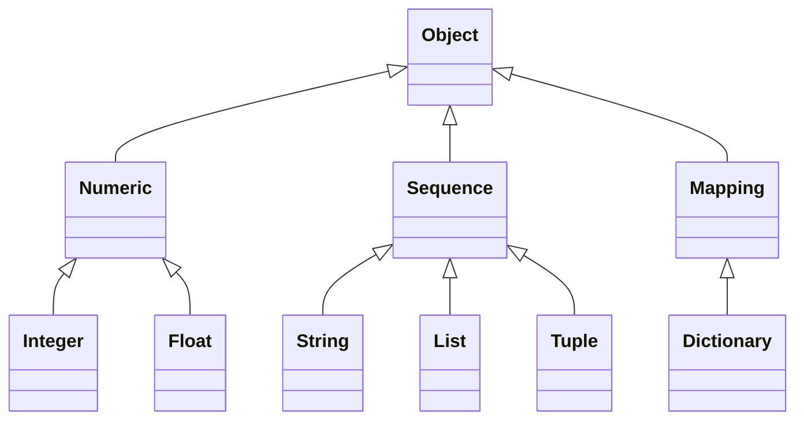

--- 

order: 3
title: Python数据类型
icon: calculate

---


Python中常见的数据类型和它们之间的关系可参考下图：



以上给出的分类是根据Python中常见的数据类型和它们之间的关系进行的。下面是对每个分类的详细说明：

::: info python数据类型解释
1. Object：
   所有Python对象的基类。

2. Numeric：
   包括整数（Integer）和浮点数（Float）两个子类，用于表示数值类型的数据。

3. Integer：
   用于表示整数类型的数据，支持整数间的加减乘除等运算。

4. Float：
   用于表示浮点数类型的数据，支持浮点数间的除法和整数除法等运算。

5. Sequence：
   表示有序的序列类型数据，包括字符串（String）、列表（List）和元组（Tuple）三个子类。

6. String：
   用于表示文本类型的数据，由一系列字符组成，支持字符串的拼接、索引和切片等操作。

7. List：
   用于表示可变的有序集合类型的数据，可以包含不同类型的元素，支持列表的追加、插入、删除、索引和切片等操作。

8. Tuple：
   用于表示不可变的有序集合类型的数据，可以包含不同类型的元素，支持元组的索引和切片等操作。

9. Mapping：
   表示键值对类型的数据，包括字典（Dictionary）和其他映射类型，用于存储具有唯一键和对应值的数据。

10. Dictionary：
    用于表示可变的键值对类型的数据，存储一组键和对应的值，支持字典的添加、修改、删除和遍历等操作。
:::


## Python常用数据类型

### 整数-int

在Python中，整数类型（int）用于表示整数值。它是一种不可变的数据类型，具有以下特点：
::: info 整数类型（int）特点
1. 范围：
   整数类型可以表示任意大小的整数，不受固定范围的限制。Python会根据需要自动调整整数的大小。

2. 运算：
   整数类型支持常见的数学运算，如加法、减法、乘法、除法和取模运算。整数运算遵循常见的算术规则。

3. 整数字面值表示：
   整数可以使用十进制、二进制、八进制和十六进制进行表示。十进制使用普通的数字表示，二进制使用前缀`0b`或`0B`，八进制使用前缀`0o`或`0O`，十六进制使用前缀`0x`或`0X`。

4. 注意事项：
   - 整数类型是不可变的，即一旦创建，就不能修改其值。任何对整数进行修改的操作都会返回一个新的整数对象。
   - 整数类型在Python中没有固定的大小限制，可以根据需要表示非常大或非常小的整数。这使得Python非常适合处理大数值计算。
   - 除法运算（`/`）始终返回浮点数结果，即使操作数都是整数。如果需要整数除法的结果，可以使用整除运算符（`//`）。
   - 取模运算（`%`）返回的结果具有与被除数相同的符号，即`a % b`的结果的符号与`a`的符号相同。
   - 在Python中，可以使用下划线将数字分组以提高可读性。例如：`1_000_000_000`表示十亿。
:::
   
下面是一些整数类型的示例代码：

```python
# 整数赋值
a = 5
b = -10
c = 1_000_000_000

# 整数运算
addition = a + b
subtraction = a - b
multiplication = a * b
division = a / b   # 返回浮点数结果
integer_division = a // b   # 返回整数结果
remainder = a % b

# 整数表示
binary = 0b1010    # 二进制表示，值为10
octal = 0o16       # 八进制表示，值为14
hexadecimal = 0xFF  # 十六进制表示，值为255

# 打印整数
print(a)   # 输出：5
print(binary)  # 输出：10
print(octal)   # 输出：14
print(hexadecimal)   # 输出：255
```

需要注意的是，在使用整数类型时，要注意整数之间的运算结果是否符合预期，以及避免除以零的情况，因为它会引发`ZeroDivisionError`异常。此外，还需要注意整数类型的精度和内存使用情况，特别是在处理大数值计算时要注意效率和内存限制。


### 浮点数-float

在Python中，浮点数类型（float）用于表示带有小数部分的数字。它是一种不可变的数据类型，具有以下特点：
::: info 浮点数类型（float）特点
1. 精度：
   浮点数类型使用==双精度浮点数==表示法，可以表示较大范围的小数，并提供一定的精度。然而，由于浮点数的存储方式，存在一定的精度限制，可能会引入舍入误差。

2. 表示：
   浮点数可以使用十进制或科学计数法表示。例如，`3.14`表示十进制浮点数，`1.23e-4`表示科学计数法浮点数。

3. 运算：
   浮点数类型支持常见的数学运算，如加法、减法、乘法和除法。浮点数运算遵循浮点数算术规则。

4. 注意事项：
   - 浮点数类型是不精确的，因为它们使用有限的位数来表示无限的小数。在进行浮点数运算时，可能会产生舍入误差。
   - 避免直接比较浮点数的相等性，因为舍入误差可能导致比较结果不准确。应该使用近似相等的比较，例如判断两个浮点数之间的差值是否小于一个很小的阈值。
   - 当需要高精度的小数运算时，可以使用`decimal`模块提供的`Decimal`类型来进行精确计算。
   - 浮点数类型还具有特殊值，如正无穷大（`float('inf')`）、负无穷大（`float('-inf')`）和非数字（`float('nan')`）。
:::
   
下面是一些浮点数类型的示例代码：

```python
# 浮点数赋值
a = 3.14
b = 2.5e-3

# 浮点数运算
addition = a + b
subtraction = a - b
multiplication = a * b
division = a / b

# 浮点数表示
scientific_notation = 6.02e23   # 科学计数法表示
negative_infinity = float('-inf')   # 负无穷大
not_a_number = float('nan')   # 非数字

# 打印浮点数
print(a)   # 输出：3.14
print(b)   # 输出：0.0025
print(scientific_notation)   # 输出：6.02e+23
print(negative_infinity)   # 输出：-inf
print(not_a_number)   # 输出：nan
```

需要注意的是，在使用浮点数类型时，应该注意舍入误差和精度问题，尤其是在进行数值计算和比较时。可以使用适当的精度控制和比较方法来处理浮点数的准确性问题


### 字符串-str

在Python中，字符串类型（str）用于表示文本数据。它是一种不可变的序列类型，具有以下特点：
::: info 字符串类型（str）特点
1. 表示：
   字符串可以使用单引号（`'`）、双引号（`"`）或三引号（`'''`或`"""`）括起来表示。使用三引号的字符串可以跨越多行，保留文本中的换行符和缩进。

2. 字符串操作：
   字符串类型支持许多操作，如字符串拼接、重复、索引和切片。可以使用加号（`+`）进行字符串拼接，使用乘号（`*`）进行重复。可以通过索引访问字符串中的单个字符，索引从0开始。还可以使用切片操作来获取子字符串。

3. 转义字符：
   字符串中可以使用转义字符来表示特殊字符，如换行符（`\n`）、制表符（`\t`）等。反斜杠（`\`）用作转义字符的前缀。

4. 字符串方法：
   字符串类型提供了许多内置方法来操作和处理字符串，如大小写转换、查找、替换、拆分、连接等。可以使用点号（`.`）和方法名称来调用字符串方法。

5. 格式化字符串：
   Python提供了多种方式来格式化字符串，如使用百分号（`%`）格式化、字符串格式化方法（`format`）和f字符串（`f-string`）。

6. 注意事项：
   - 字符串是不可变的，一旦创建，就不能修改其值。任何对字符串进行修改的操作都会返回一个新的字符串。
   - 字符串是按照Unicode编码进行存储和处理的，因此可以表示任意字符集。
   - 需要注意字符串中的空格和大小写，因为它们在比较和匹配时是敏感的。
   - 使用引号时要注意匹配，确保开始和结束的引号一致。
:::
   
下面是一些字符串类型的示例代码：

```python
# 字符串赋值
name = 'Alice'
message = "Hello, World!"

# 字符串拼接和重复
greeting = 'Hello' + ' ' + name
repeated_message = message * 3

# 字符串索引和切片
first_char = name[0]
substring = message[7:12]

# 转义字符
escaped_string = 'This is a line\nThis is a tab\tThis is a backslash\\'

# 字符串方法
uppercase_name = name.upper()
index = message.find('World')
replaced_message = message.replace('World', 'Python')
splitted_words = message.split(',')

# 格式化字符串
formatted_string = 'My name is %s and I am %d years old.' % ('Alice', 25)
formatted_string2 = 'My name is {} and I am {} years old.'.format('Alice', 25)
f_string = f'My name is {name} and I am {25} years old.'

# 打印字符串
print(name)   # 输出：

Alice
print(message)   # 输出：Hello, World!
print(greeting)   # 输出：Hello Alice
print(repeated_message)   # 输出：Hello, World!Hello, World!Hello, World!
print(first_char)   # 输出：A
print(substring)   # 输出：World
print(escaped_string)   # 输出：This is a line\nThis is a tab\tThis is a backslash\
print(uppercase_name)   # 输出：ALICE
print(index)   # 输出：7
print(replaced_message)   # 输出：Hello, Python!
print(splitted_words)   # 输出：['Hello', ' World!']
print(formatted_string)   # 输出：My name is Alice and I am 25 years old.
print(formatted_string2)   # 输出：My name is Alice and I am 25 years old.
print(f_string)   # 输出：My name is Alice and I am 25 years old.
```

需要注意的是，字符串在使用过程中要注意转义字符的使用和处理，以及字符串的比较和匹配的大小写问题。此外，了解和熟悉字符串的内置方法可以帮助处理字符串的操作和转换。


### 列表-list

在Python中，列表（List）是一种有序、可变、可以包含不同类型元素的数据结构。列表使用方括号`[]`表示，各个元素之间用逗号分隔。

1. 创建列表：
   ```python
   # 创建一个空列表
   empty_list = []

   # 创建包含元素的列表
   numbers = [1, 2, 3, 4, 5]
   fruits = ['apple', 'banana', 'orange']
   mixed = [1, 'apple', True, 2.5]
   ```

2. 访问列表元素：
   - 使用索引：可以使用索引来访问列表中的特定元素。索引从0开始，表示第一个元素。
     ```python
     fruits = ['apple', 'banana', 'orange']
     print(fruits[0])  # 输出：apple
     print(fruits[1])  # 输出：banana
     ```

   - 使用负索引：可以使用负索引从列表末尾开始访问元素。-1表示最后一个元素，-2表示倒数第二个元素，依此类推。
     ```python
     fruits = ['apple', 'banana', 'orange']
     print(fruits[-1])  # 输出：orange
     print(fruits[-2])  # 输出：banana
     ```

   - 使用切片：可以使用切片操作来获取列表的子列表。
     ```python
     numbers = [1, 2, 3, 4, 5]
     print(numbers[1:4])  # 输出：[2, 3, 4]
     ```

3. 列表操作：
   - 添加元素：使用`append()`方法在列表末尾添加一个元素。
     ```python
     fruits = ['apple', 'banana', 'orange']
     fruits.append('grape')
     print(fruits)  # 输出：['apple', 'banana', 'orange', 'grape']
     ```

   - 修改元素：通过索引对列表元素进行赋值，可以修改列表中的元素。
     ```python
     fruits = ['apple', 'banana', 'orange']
     fruits[1] = 'mango'
     print(fruits)  # 输出：['apple', 'mango', 'orange']
     ```

   - 删除元素：使用`del`语句或`remove()`方法可以删除列表中的元素。
     ```python
     fruits = ['apple', 'banana', 'orange']
     del fruits[0]
     print(fruits)  # 输出：['banana', 'orange']

     fruits.remove('banana')
     print(fruits)  # 输出：['orange']
     ```

4. 注意事项：
   - 列表是可变的，可以通过索引或方法来修改列表中的元素。
   - 列表可以包含不同类型的元素，甚至可以包含其他列表。
   - 列表的长度可以动态增加或减少。
   - 列表是有序的，保持元素插入的顺序。
   - 列表是可迭代对象，可以使用循环遍历列表中的元素。

列表是Python中常用且灵活的数据结构，可以方便地存储和操作多个元素。它在数据处理、算法实现等方面具有广泛的应用。


### 元组-tuple

在Python中，元组（Tuple）是一种有序、不可变的数据结构，类似于列表，但元组的元素不可修改。元组使用圆括号`()`表示，各个元素之间用逗号分隔。

1. 创建元组：
   ```python
   # 创建一个空元组
   empty_tuple = ()

   # 创建包含元素的元组
   numbers = (1, 2, 3, 4, 5)
   fruits = ('apple', 'banana', 'orange')
   mixed = (1, 'apple', True, 2.5)
   ```

2. 访问元组元素：
   - 使用索引：可以使用索引来访问元组中的特定元素。索引从0开始，表示第一个元素。
     ```python
     fruits = ('apple', 'banana', 'orange')
     print(fruits[0])  # 输出：apple
     print(fruits[1])  # 输出：banana
     ```

   - 使用负索引：可以使用负索引从元组末尾开始访问元素。-1表示最后一个元素，-2表示倒数第二个元素，依此类推。
     ```python
     fruits = ('apple', 'banana', 'orange')
     print(fruits[-1])  # 输出：orange
     print(fruits[-2])  # 输出：banana
     ```

   - 使用切片：可以使用切片操作来获取元组的子元组。
     ```python
     numbers = (1, 2, 3, 4, 5)
     print(numbers[1:4])  # 输出：(2, 3, 4)
     ```

3. 元组操作：
   - 元组不可修改：元组是不可变的，一旦创建后，无法修改元素的值或增删元素。这是与列表的主要区别。
   - 元组可以进行连接和重复操作，生成新的元组。
     ```python
     tup1 = (1, 2, 3)
     tup2 = ('a', 'b', 'c')
     new_tuple = tup1 + tup2
     print(new_tuple)  # 输出：(1, 2, 3, 'a', 'b', 'c')

     repeated_tuple = tup1 * 3
     print(repeated_tuple)  # 输出：(1, 2, 3, 1, 2, 3, 1, 2, 3)
     ```

4. 注意事项：
   - 元组是不可变的，无法修改元素的值或增删元素。如果需要修改元素，应使用列表。
   - 元组在处理大量数据时更加高效，因为不可变性使得元组具有更快的访问速度。
   - 元组可以作为字典的键，而列表不能，因为字典的键必须是不可变的。
   - 元组可以作为函数的参数和返回值，可以用于多个值的传递和返回。

元组提供了一种简单的、不可变的数据结构，适用于存储不需要修改的数据，例如常量、配置信息等。它还可以用于多个值的传递和返回，以及在字典中作为键使用。


### 字典-Dictionary

在Python中，字典（Dictionary）是一种无序、可变、存储键值对的数据结构。字典使用花括号`{}`表示，每个键值对之间用冒号`:`分隔，键和值之间用逗号`,`分隔。

1. 创建字典：
   ```python
   # 创建一个空字典
   empty_dict = {}

   # 创建包含键值对的字典
   student = {'name': 'Alice', 'age': 20, 'grade': 'A'}
   employee = {'name': 'John', 'age': 30, 'department': 'HR'}
   ```

2. 访问字典元素：
   - 使用键来访问值：可以使用键来访问字典中对应的值。
     ```python
     student = {'name': 'Alice', 'age': 20, 'grade': 'A'}
     print(student['name'])  # 输出：Alice
     print(student['age'])   # 输出：20
     ```

   - 使用`get()`方法：可以使用`get()`方法来安全地获取字典中的值，避免键不存在引发错误。
     ```python
     student = {'name': 'Alice', 'age': 20, 'grade': 'A'}
     print(student.get('name'))  # 输出：Alice
     print(student.get('score'))  # 输出：None
     ```

3. 字典操作：
   - 修改字典元素：可以通过键来修改字典中的值。
     ```python
     student = {'name': 'Alice', 'age': 20, 'grade': 'A'}
     student['age'] = 21
     print(student)  # 输出：{'name': 'Alice', 'age': 21, 'grade': 'A'}
     ```

   - 添加新键值对：可以通过赋值语句添加新的键值对。
     ```python
     student = {'name': 'Alice', 'age': 20}
     student['grade'] = 'A'
     print(student)  # 输出：{'name': 'Alice', 'age': 20, 'grade': 'A'}
     ```

   - 删除键值对：使用`del`语句或`pop()`方法可以删除字典中的键值对。
     ```python
     student = {'name': 'Alice', 'age': 20, 'grade': 'A'}
     del student['age']
     print(student)  # 输出：{'name': 'Alice', 'grade': 'A'}

     grade = student.pop('grade')
     print(grade)    # 输出：A
     ```

4. 注意事项：
   - 字典中的键必须是唯一的，不可重复。如果重复使用相同的键，后面的键值对将覆盖前面的。
   - 字典是无序的，不保持键值对的顺序。
   - 字典是可变的，可以修改、添加或删除键值对。
   - 字典是可迭代对象，可以使用循环遍历键或值。

字典是Python中常用的数据结构，适用于存储和处理键值对相关的数据，如配置信息、映射关系等。它具有快速查找和更新的特性，可以高效地处理大量的数据。


## 特殊操作及数据类型

### 格式化字符串

在Python中，格式化字符串是一种方便的方式，用于将变量值、表达式或其他数据插入到字符串中。Python提供了几种方法来格式化字符串，包括百分号格式化、字符串格式化方法和f字符串（f-string）。

1. 百分号格式化：
   百分号格式化是Python中最早引入的字符串格式化方法之一。它使用百分号（%）作为占位符，并根据需要使用对应的格式说明符进行替换。

   ```python
   name = 'Alice'
   age = 25
   formatted_string = 'My name is %s and I am %d years old.' % (name, age)
   ```

   在上面的示例中，`%s`表示字符串类型的占位符，`%d`表示整数类型的占位符。在字符串后面使用`%`运算符，然后将要替换的值作为元组传递给`%`运算符。

2. 字符串格式化方法：
   字符串格式化方法使用`format`方法来格式化字符串，它使用大括号（{}）作为占位符，并使用位置参数或关键字参数指定要替换的值。

   ```python
   name = 'Alice'
   age = 25
   formatted_string = 'My name is {} and I am {} years old.'.format(name, age)
   ```

   在上面的示例中，大括号中不包含任何内容，即使用默认的位置参数顺序进行替换。

3. f字符串（f-string）：
   f字符串是Python 3.6版本引入的一种新的字符串格式化方法，它以字母"f"或"F"开头，使用大括号（{}）包含表达式，可以直接在字符串中引用变量和表达式的值。

   ```python
   name = 'Alice'
   age = 25
   formatted_string = f'My name is {name} and I am {age} years old.'
   ```

   在上面的示例中，使用大括号包围变量名和表达式，并将其直接嵌入到字符串中。

注意事项：
- 格式化字符串时要确保占位符和要替换的值类型匹配。例如，使用`%s`占位符时，要替换的值应该是字符串类型。
- 当使用百分号格式化时，可以使用不同的格式说明符来控制替换值的格式，如浮点数的小数位数、对齐等。详细的格式说明符可以参考Python的文档。
- 字符串格式化方法和f字符串相对于百分号格式化更加灵活和直观，推荐在新的代码中使用它们。
- 在使用f字符串时，可以在大括号中使用表达式，可以进行简单的计算和函数调用。

::: info Python字符串格式说明符
在百分号格式化中，格式说明符用于控制替换值的显示方式。以下是一些常用的格式说明符和示例：

- `%s`：字符串类型
  ```python
  name = 'Alice'
  formatted_string = 'My name is %s.' % name
  print(formatted_string)  # 输出：My name is Alice.
  ```

- `%d`：整数类型
  ```python
  age = 25
  formatted_string = 'I am %d years old.' % age
  print(formatted_string)  # 输出：I am 25 years old.
  ```

- `%f`：浮点数类型
  ```python
  height = 1.75
  formatted_string = 'My height is %.2f meters.' % height
  print(formatted_string)  # 输出：My height is 1.75 meters.
  ```

- `%x`：十六进制整数类型
  ```python
  number = 255
  formatted_string = 'The number in hex is %x.' % number
  print(formatted_string)  # 输出：The number in hex is ff.
  ```

- `%o`：八进制整数类型
  ```python
  number = 8
  formatted_string = 'The number in octal is %o.' % number
  print(formatted_string)  # 输出：The number in octal is 10.
  ```

- `%e`：指数表示的浮点数类型
  ```python
  value = 1000000
  formatted_string = 'The value is %e.' % value
  print(formatted_string)  # 输出：The value is 1.000000e+06.
  ```

- `%g`：浮点数类型的通用格式
  ```python
  number = 0.00001
  formatted_string = 'The number is %g.' % number
  print(formatted_string)  # 输出：The number is 1e-05.
  ```

这些只是格式说明符的一小部分，还有更多的选项和标志可以使用。更详细的格式说明符信息可以在Python官方文档中找到。

官方文档链接：[https://docs.python.org/3/library/stdtypes.html#printf-style-string-formatting](https://docs.python.org/3/library/stdtypes.html#printf-style-string-formatting)
:::


### 序列索引-index
在Python中，索引用于访问序列（如字符串、列表、元组等）中的元素。索引从0开始，表示第一个元素，依次递增。索引可以是正数，也可以是负数。

1. 正向索引：正向索引从0开始，依次递增。第一个元素的索引为0，第二个元素的索引为1，以此类推。例如，对于字符串`"Hello"`，索引如下：

   ```
   +---+---+---+---+---+
   | H | e | l | l | o |
   +---+---+---+---+---+
     0   1   2   3   4
   ```

2. 反向索引：反向索引从-1开始，依次递减。最后一个元素的索引为-1，倒数第二个元素的索引为-2，以此类推。例如，对于字符串`"Hello"`，反向索引如下：

   ```
   +---+---+---+---+---+
   | H | e | l | l | o |
   +---+---+---+---+---+
    -5  -4  -3  -2  -1
   ```

注意事项：
- 使用索引访问元素时，应确保索引在序列的范围内，否则会引发`IndexError`。
- 索引可以用于获取单个元素的值，例如`sequence[index]`。
- 索引还可以用于切片操作，以获取序列的子序列，例如`sequence[start:end]`。
- 索引可以是变量或表达式的结果，只要结果是整数。
- 索引值不可变，不能直接修改。

示例代码：
```python
# 字符串索引示例
s = "Hello"
print(s[0])   # 输出：H
print(s[4])   # 输出：o
print(s[-1])  # 输出：o

# 列表索引示例
lst = [1, 2, 3, 4, 5]
print(lst[2])   # 输出：3
print(lst[-3])  # 输出：3

# 元组索引示例
tup = (10, 20, 30, 40, 50)
print(tup[3])   # 输出：40
print(tup[-2])  # 输出：40
```

索引在Python中是一种常见且重要的操作，它使得我们可以按照位置访问序列中的元素，进行数据的读取和处理。


### 序列切片-slicing

在Python中，切片（slicing）是一种用于获取序列（如字符串、列表、元组等）中一部分元素的操作。通过指定起始索引和结束索引，可以截取序列中的连续元素子集。

切片操作的语法是：`sequence[start:end:step]`，其中：
- `start`：起始索引（包含），默认为0（表示从序列的开头开始）。
- `end`：结束索引（不包含），默认为序列的长度（表示到序列的末尾）。
- `step`：步长，表示每次获取元素的间隔，默认为1（表示连续获取元素）。

注意事项：
- ==切片操作不会修改原始序列，而是返回一个新的切片对象。==
- 索引和切片操作都使用半开区间（左闭右开），即起始索引包含在切片中，而结束索引不包含在切片中。
- 如果省略起始索引和结束索引，则默认使用序列的开始和结束。
- 如果指定的索引超出了序列的范围，切片操作仍然会返回结果，不会引发索引错误。

下面是一些切片的示例代码：

```python
# 字符串切片
s = 'Hello, World!'
print(s[7:12])    # 输出：World

# 列表切片
numbers = [1, 2, 3, 4, 5, 6, 7, 8, 9, 10]
print(numbers[2:6])    # 输出：[3, 4, 5, 6]

# 元组切片
fruits = ('apple', 'banana', 'cherry', 'durian', 'elderberry')
print(fruits[1:4])    # 输出：('banana', 'cherry', 'durian')

# 切片步长
numbers = [1, 2, 3, 4, 5, 6, 7, 8, 9, 10]
print(numbers[::2])    # 输出：[1, 3, 5, 7, 9]

# 反向切片
s = 'Hello, World!'
print(s[::-1])    # 输出：!dlroW ,olleH

# 省略起始索引和结束索引
numbers = [1, 2, 3, 4, 5, 6, 7, 8, 9, 10]
print(numbers[:5])    # 输出：[1, 2, 3, 4, 5]
print(numbers[5:])    # 输出：[6, 7, 8, 9, 10]

# 超出范围的索引
numbers = [1, 2, 3, 4, 5, 6, 7, 8, 9, 10]
print(numbers[20:30])    # 输出：[]，超出范围仍返回空列表
```

通过使用切片操作，可以轻松地获取序列中的子集，处理序列的部分元素。同时，注意 选择适当的起始索引、结束索引和步长，以确保得到期望的切片结果。


### 无序容器-集合(set)

在Python中，集合（Set）是一种无序、可变的容器，用于存储唯一的元素。集合中的元素不会重复，且没有固定的顺序。Python提供了内置的`set`类型来表示集合。下面是关于集合的详细介绍：

1. 创建集合：
   可以使用花括号 `{}` 或 `set()` 函数来创建一个集合。注意，如果要创建空集合，==必须使用 `set()` 而不是 `{}`，因为 `{}` 创建的是一个空字典==。
   ```python
   fruits = {'apple', 'banana', 'orange'}
   empty_set = set()
   ```

2. 集合的特性：
    - 集合中的元素是唯一的，不会重复。
    - 集合中的元素是无序的，无法通过索引访问。
    - 集合是可变的，可以添加、删除元素。
    - 集合中的元素必须是可哈希的，即不可变的类型，例如整数、浮点数、字符串、元组等。

3. 集合操作：
    - 添加元素：使用 `add()` 方法添加单个元素，使用 `update()` 方法添加多个元素。
    - 删除元素：使用 `remove()` 方法删除指定元素，如果元素不存在会引发 `KeyError` 异常；使用 `discard()` 方法删除指定元素，如果元素不存在不会引发异常；使用 `pop()` 方法随机删除一个元素。
    - 判断元素是否存在：使用 `in` 关键字判断元素是否在集合中。
    - 集合运算：包括并集、交集、差集、对称差集等操作，可以使用对应的方法或运算符来进行操作。

4. 示例代码：
   ```python
   # 创建集合
   fruits = {'apple', 'banana', 'orange'}

   # 添加元素
   fruits.add('grape')
   fruits.update(['mango', 'kiwi'])

   # 删除元素
   fruits.remove('banana')
   fruits.discard('watermelon')

   # 判断元素是否存在
   if 'apple' in fruits:
       print("苹果存在于集合中")

   # 集合运算
   set1 = {1, 2, 3}
   set2 = {2, 3, 4}

   union_set = set1.union(set2)           # 并集
   intersection_set = set1.intersection(set2)   # 交集
   difference_set = set1.difference(set2)       # 差集
   symmetric_difference_set = set1.symmetric_difference(set2)   # 对称差集
   ```

5. 注意事项：
    - 集合中的元素是无序的，不能通过索引进行访问。
    - 集合中的元素必须是可哈希的，因此集合本身不能包含可变的元素（如列表、字典等）。
    - 集合是可变的，可以通过添加、删除等操作来修改集合。
    - 集合中的元素不会重复，重复的元素会被自动去重。

集合在处理需要唯一元素且不关心元素顺序的情况下非常有用。它提供了高效的成员检查和集合运算操作，可以帮助简化代码并提高效率。


### 布尔类型-bool

在Python中，布尔类型（bool）是表示逻辑值的数据类型，它只有两个取值：`True`（真）和`False`（假）。布尔类型通常用于条件判断和逻辑运算。下面是关于布尔类型的详细介绍：

1. 创建布尔类型：
   布尔类型的取值只有两个：`True`和`False`。可以直接使用这两个关键字来创建布尔类型变量。
   ```python
   flag = True
   status = False
   ```

2. 布尔运算：
    - 与运算（and）：只有两个操作数都为`True`时，结果才为`True`，否则结果为`False`。
    - 或运算（or）：两个操作数中只要有一个为`True`，结果就为`True`，否则结果为`False`。
    - 非运算（not）：对操作数进行取反，如果操作数为`True`，则结果为`False`；如果操作数为`False`，则结果为`True`。

3. 示例代码：
   ```python
   x = 5
   y = 10
   z = 3

   # 与运算
   result1 = (x < y) and (y < z)
   print(result1)    # 输出：False

   # 或运算
   result2 = (x > y) or (y > z)
   print(result2)    # 输出：True

   # 非运算
   result3 = not (x < y)
   print(result3)    # 输出：False
   ```

4. 注意事项：
    - 布尔类型只有两个取值：`True`和`False`，且首字母需大写。
    - 布尔类型经常用于条件判断，例如在`if`语句中根据条件的真假来执行相应的代码块。
    - 布尔类型可以与其他数据类型进行逻辑运算，例如与数字、字符串等进行比较和运算。
    - 注意区分布尔类型的赋值和比较运算符，赋值使用单个等号（`=`），比较运算使用双等号（`==`）。

布尔类型在编程中经常用于条件判断和逻辑运算，它是控制程序流程和决策的基础。合理运用布尔类型可以使代码更加清晰、简洁和易读。


### 如何判断数据类型

在Python中，可以使用多种方式来判断数据的类型。下面介绍常用的几种方式及注意事项：

1. 使用`type()`函数：
   可以使用内置的`type()`函数来获取一个对象的类型。例如：
   ```python
   x = 5
   y = "Hello"
   z = [1, 2, 3]

   print(type(x))   # 输出：<class 'int'>
   print(type(y))   # 输出：<class 'str'>
   print(type(z))   # 输出：<class 'list'>
   ```

2. 使用`isinstance()`函数：
   `isinstance()`函数用于检查一个对象是否属于指定的类型。它可以判断对象是否为特定类型或其子类的实例。例如：
   ```python
   x = 5
   y = "Hello"
   z = [1, 2, 3]

   print(isinstance(x, int))      # 输出：True
   print(isinstance(y, str))      # 输出：True
   print(isinstance(z, list))     # 输出：True
   print(isinstance(z, object))   # 输出：True，因为所有对象都是object的实例
   ```

3. 使用`type()`和类型比较：
   可以使用`type()`函数获取对象的类型，并与预期的类型进行比较判断。例如：
   ```python
   x = 5

   if type(x) == int:
       print("x是整数")
   ```

注意事项：
- 在判断类型时，要注意Python中的类型是大小写敏感的，例如`int`和`Int`是不同的类型。
- 需要注意的是，使用类型判断并不总是推荐的做法。在动态语言中，更常见的做法是根据对象的特性和行为来处理，而不仅仅关注对象的类型。这样可以增加代码的灵活性和可维护性。
- 在使用`isinstance()`函数判断对象的类型时，要考虑到继承关系。如果对象是某个类的实例，那么也可以判断为其父类的实例。
- 使用类型判断时，应注意使用具体的类型进行判断，而不是使用抽象的基类（如`object`）进行判断，以避免出现错误的判断结果。


## collections标准库

Python的`collections`模块是标准库中的一个模块，提供了一些额外的数据类型，用于扩展内置的数据类型（如字典、列表等），以满足特定的需求。下面介绍一些常用的数据类型及其功能：

### `namedtuple`（命名元组）
`namedtuple`是一个具有命名字段的元组，可以像对象一样访问元组中的字段，而无需使用索引。它提供了更具可读性和易用性的方式来创建和操作简单的数据对象。
```python
from collections import namedtuple

# 创建一个命名元组类型
Point = namedtuple('Point', ['x', 'y'])

# 创建一个命名元组对象
p = Point(2, 3)

print(p.x)   # 输出：2
print(p.y)   # 输出：3
```

### `deque`（双向队列）
   `deque`是一个双向队列，可以从队列的两端高效地进行添加和删除操作。它提供了比列表更快的插入和删除操作，适用于需要频繁地进行队列操作的场景。
   ```python
   from collections import deque

   # 创建一个双向队列
   queue = deque()

   # 在队尾添加元素
   queue.append(1)
   queue.append(2)
   queue.append(3)

   print(queue)        # 输出：deque([1, 2, 3])

   # 从队头弹出元素
   item = queue.popleft()

   print(item)         # 输出：1
   print(queue)        # 输出：deque([2, 3])
   ```

### `defaultdict`（默认字典）
   `defaultdict`是一个具有默认值的字典，当访问不存在的键时，会返回默认值而不是引发`KeyError`异常。默认值是通过一个工厂函数提供的。
   ```python
   from collections import defaultdict

   # 创建一个默认字典，将不存在的键映射为列表
   d = defaultdict(list)

   d['fruits'].append('apple')
   d['fruits'].append('banana')
   d['fruits'].append('orange')

   print(d['fruits'])   # 输出：['apple', 'banana', 'orange']
   ```

### `Counter`（计数器）
   `Counter`是一个简单的计数器，用于统计可迭代对象中各元素的出现次数，并以字典形式返回。
   ```python
   from collections import Counter

   # 创建一个计数器
   c = Counter(['apple', 'banana', 'apple', 'orange', 'banana'])

   print(c)            # 输出：Counter({'apple': 2, 'banana': 2, 'orange': 1})
   print(c['apple'])   # 输出：2
   ```

